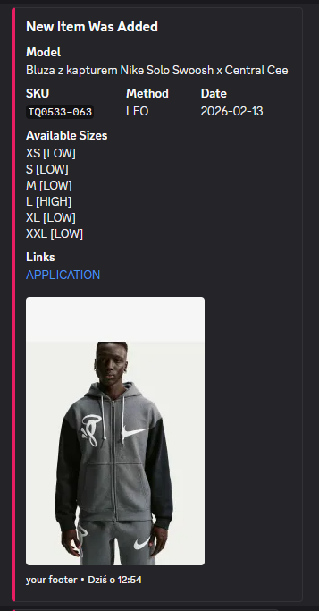
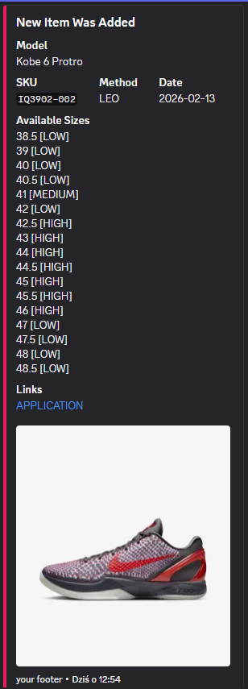
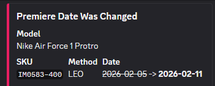
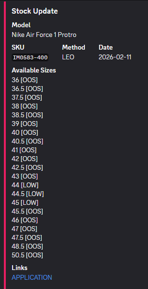
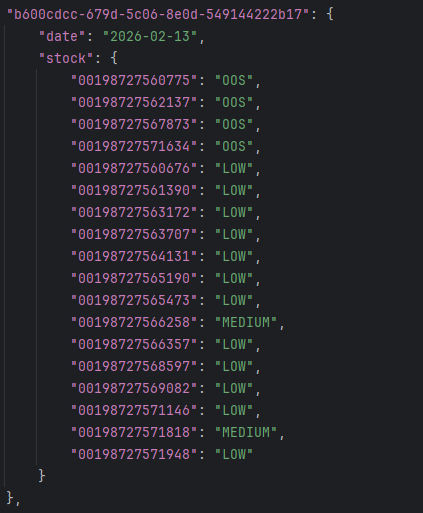

# SNKRS NIKE API Monitor Discord  
Nike SNKRS product monitor that sends notifications to a Discord server regarding new items, release date changes, and stock updates.  

### Features  
Nike API Monitoring: Automatically checks upcoming releases for the selected region.  

### Webhook Notifications  
Notification system for New Item, Date Changed, and Stock Update statuses.  

| | |
|:---:|:---:|
|  |  |
|  |  |

### Local Database  
Saves product states in an inventory.json file to track changes.   

  

### User-Agents Support  
Ability to rotate browser headers using a users.txt file.  

### Logging  
The monitor features a built-in logging system that tracks every action in real-time. Logs are displayed in the console with the following information:  
- The exact time of the event.  
- Categorization of the log (INFO for general updates, ERROR for issues).  
- Details about API requests, detected products, and webhook status.  

  

### Configuration  
config.py file: Enter your Discord Webhook URL in the Monitor_Discord_Channel_Webhooks_List.  
users.txt file: Add a list of User-Agent headers (one per line).  

### Library Installation  
Run the command: pip install requests.  

### Requirements  
Python 3.x  
requests library
